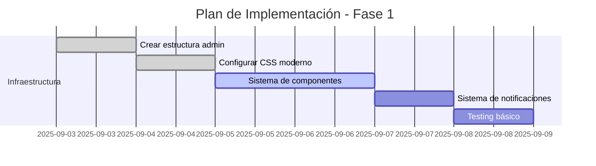
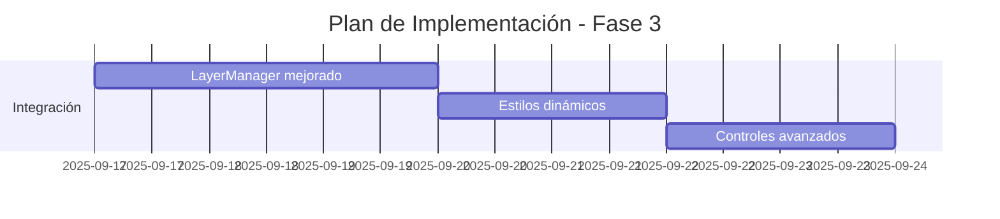
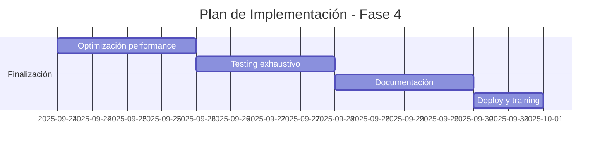
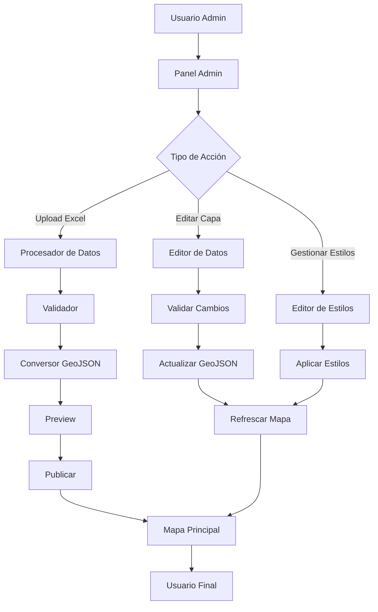

# 🚀 Plan de Mejoras para CLIOPE

Este documento detalla las mejoras propuestas para el proyecto CLIOPE, incluyendo la implementación de un panel de administración y modernización de la interfaz.

## 📋 Índice

- [Resumen Ejecutivo](#resumen-ejecutivo)
- [Mejoras Propuestas](#mejoras-propuestas)
- [Panel de Administración](#panel-de-administración)
- [Modernización de UI/UX](#modernización-de-uiux)
- [Optimizaciones de Performance](#optimizaciones-de-performance)
- [Plan de Implementación](#plan-de-implementación)
- [Arquitectura Técnica](#arquitectura-técnica)
- [Cronograma](#cronograma)
- [Riesgos y Mitigaciones](#riesgos-y-mitigaciones)

## 🎯 Resumen Ejecutivo

### Objetivo Principal
Transformar CLIOPE de un atlas estático a una **plataforma administrativa dinámica** que permita a usuarios no técnicos gestionar capas y datos de forma intuitiva, manteniendo la compatibilidad con el sistema actual.

### Beneficios Esperados
- ✅ **Autonomía administrativa**: Gestión sin conocimientos técnicos
- ✅ **Reducción de tiempo**: De horas a minutos para actualizar datos
- ✅ **Escalabilidad**: Fácil incorporación de nuevas fuentes de datos
- ✅ **Mantenimiento**: Interfaz moderna y mantenible
- ✅ **Experiencia de usuario**: UI/UX profesional y responsive

### Inversión Estimada
- **Tiempo de desarrollo**: 3-4 semanas
- **Complejidad**: Media (mantiene stack actual)
- **Riesgo**: Bajo (mejoras incrementales)

## 🔧 Mejoras Propuestas

### 1. **Panel de Administración** 🎛️

#### Funcionalidades Core
```javascript
// Capacidades principales del panel
const adminFeatures = {
  dataManagement: {
    excelUpload: "Subida de archivos Excel/CSV con drag & drop",
    dataValidation: "Validación automática de formatos y coordenadas",
    geoConversion: "Conversión automática a GeoJSON",
    previewMode: "Vista previa antes de publicar"
  },
  layerManagement: {
    crud: "Crear, leer, actualizar, eliminar capas",
    styling: "Editor visual de estilos de capas",
    visibility: "Control de visibilidad y opacity",
    metadata: "Gestión de metadatos y descripciones"
  },
  publishing: {
    staging: "Ambiente de pruebas",
    backup: "Respaldos automáticos antes de cambios",
    rollback: "Capacidad de revertir cambios",
    notifications: "Sistema de notificaciones de estado"
  }
}
```

#### Interfaz de Usuario
```html
<!-- Estructura del panel de administración -->
<div class="admin-layout">
  <!-- Header con navegación -->
  <header class="admin-header">
    <nav class="admin-nav">
      <button class="nav-tab active" data-section="layers">
        📍 Gestión de Capas
      </button>
      <button class="nav-tab" data-section="data">
        📊 Editor de Datos
      </button>
      <button class="nav-tab" data-section="preview">
        👁️ Vista Previa
      </button>
      <button class="nav-tab" data-section="settings">
        ⚙️ Configuración
      </button>
    </nav>
  </header>

  <!-- Área principal de trabajo -->
  <main class="admin-workspace">
    <!-- Sección de gestión de capas -->
    <section id="layers-section" class="admin-section active">
      <!-- Upload zone -->
      <div class="upload-zone">
        <div class="dropzone">
          <h3>📁 Subir archivo Excel/CSV</h3>
          <p>Arrastra aquí o haz clic para seleccionar</p>
        </div>
      </div>

      <!-- Lista de capas existentes -->
      <div class="layers-manager">
        <div class="layers-list">
          <!-- Capas se cargan dinámicamente -->
        </div>
      </div>
    </section>
  </main>
</div>
```

### 2. **Sistema de Conversión de Datos** 📊

#### Pipeline de Procesamiento
```javascript
class DataProcessor {
  constructor() {
    this.supportedFormats = ['xlsx', 'xls', 'csv'];
    this.validationRules = new ValidationEngine();
    this.geoConverter = new GeoJSONConverter();
  }

  async processFile(file) {
    // 1. Validar formato
    const format = this.detectFormat(file);
    if (!this.supportedFormats.includes(format)) {
      throw new Error(`Formato ${format} no soportado`);
    }

    // 2. Leer contenido
    const rawData = await this.readFile(file, format);
    
    // 3. Validar estructura
    const validationResult = this.validationRules.validate(rawData);
    if (!validationResult.isValid) {
      throw new ValidationError(validationResult.errors);
    }

    // 4. Detectar coordenadas
    const coordinateMapping = this.detectCoordinates(rawData);
    
    // 5. Convertir a GeoJSON
    const geoJSON = this.geoConverter.convert(rawData, coordinateMapping);
    
    // 6. Generar metadatos
    const metadata = this.generateMetadata(geoJSON, file);

    return {
      geoJSON,
      metadata,
      originalData: rawData,
      mapping: coordinateMapping
    };
  }

  detectCoordinates(data) {
    const headers = Object.keys(data[0]);
    
    const coordinatePatterns = {
      latitude: /^(lat|latitude|y|coord_y|norte)$/i,
      longitude: /^(lng|lon|longitude|x|coord_x|este)$/i
    };

    const mapping = {
      latitude: null,
      longitude: null,
      detected: false
    };

    headers.forEach(header => {
      if (coordinatePatterns.latitude.test(header)) {
        mapping.latitude = header;
      }
      if (coordinatePatterns.longitude.test(header)) {
        mapping.longitude = header;
      }
    });

    mapping.detected = mapping.latitude && mapping.longitude;
    return mapping;
  }
}
```

#### Validador de Datos
```javascript
class ValidationEngine {
  constructor() {
    this.rules = [
      new CoordinateValidator(),
      new DataTypeValidator(),
      new RequiredFieldValidator(),
      new UniqueIdValidator()
    ];
  }

  validate(data) {
    const errors = [];
    const warnings = [];

    this.rules.forEach(rule => {
      const result = rule.validate(data);
      errors.push(...result.errors);
      warnings.push(...result.warnings);
    });

    return {
      isValid: errors.length === 0,
      errors,
      warnings,
      summary: this.generateSummary(data, errors, warnings)
    };
  }
}

class CoordinateValidator {
  validate(data) {
    const errors = [];
    
    data.forEach((row, index) => {
      const lat = parseFloat(row.latitude);
      const lng = parseFloat(row.longitude);
      
      if (isNaN(lat) || lat < -90 || lat > 90) {
        errors.push({
          type: 'invalid_latitude',
          row: index + 1,
          value: row.latitude,
          message: `Latitud inválida en fila ${index + 1}: ${row.latitude}`
        });
      }
      
      if (isNaN(lng) || lng < -180 || lng > 180) {
        errors.push({
          type: 'invalid_longitude',
          row: index + 1,
          value: row.longitude,
          message: `Longitud inválida en fila ${index + 1}: ${row.longitude}`
        });
      }
    });

    return { errors, warnings: [] };
  }
}
```

### 3. **Modernización de UI/UX** 🎨

#### Sistema de Diseño
```css
/* Variables CSS para consistencia */
:root {
  /* Colores principales */
  --cliope-primary: #2563eb;
  --cliope-secondary: #10b981;
  --cliope-accent: #f59e0b;
  --cliope-danger: #ef4444;
  
  /* Grises */
  --gray-50: #f9fafb;
  --gray-100: #f3f4f6;
  --gray-200: #e5e7eb;
  --gray-300: #d1d5db;
  --gray-400: #9ca3af;
  --gray-500: #6b7280;
  --gray-600: #4b5563;
  --gray-700: #374151;
  --gray-800: #1f2937;
  --gray-900: #111827;
  
  /* Espaciado */
  --spacing-xs: 0.25rem;
  --spacing-sm: 0.5rem;
  --spacing-md: 1rem;
  --spacing-lg: 1.5rem;
  --spacing-xl: 2rem;
  --spacing-2xl: 3rem;
  
  /* Tipografía */
  --font-family-sans: -apple-system, BlinkMacSystemFont, 'Segoe UI', Roboto, sans-serif;
  --font-size-xs: 0.75rem;
  --font-size-sm: 0.875rem;
  --font-size-base: 1rem;
  --font-size-lg: 1.125rem;
  --font-size-xl: 1.25rem;
  --font-size-2xl: 1.5rem;
  --font-size-3xl: 1.875rem;
  
  /* Bordes y sombras */
  --border-radius: 0.375rem;
  --border-radius-lg: 0.5rem;
  --shadow-sm: 0 1px 2px 0 rgba(0, 0, 0, 0.05);
  --shadow: 0 1px 3px 0 rgba(0, 0, 0, 0.1);
  --shadow-lg: 0 10px 15px -3px rgba(0, 0, 0, 0.1);
  
  /* Transiciones */
  --transition-fast: 150ms ease-in-out;
  --transition-normal: 250ms ease-in-out;
  --transition-slow: 350ms ease-in-out;
}

/* Componentes base */
.btn {
  display: inline-flex;
  align-items: center;
  gap: var(--spacing-sm);
  padding: var(--spacing-sm) var(--spacing-md);
  border: 1px solid transparent;
  border-radius: var(--border-radius);
  font-family: var(--font-family-sans);
  font-size: var(--font-size-sm);
  font-weight: 500;
  line-height: 1.5;
  text-decoration: none;
  cursor: pointer;
  transition: all var(--transition-fast);
  user-select: none;
}

.btn:focus {
  outline: 2px solid var(--cliope-primary);
  outline-offset: 2px;
}

.btn:disabled {
  opacity: 0.5;
  cursor: not-allowed;
}

/* Variantes de botones */
.btn-primary {
  background-color: var(--cliope-primary);
  color: white;
  border-color: var(--cliope-primary);
}

.btn-primary:hover:not(:disabled) {
  background-color: #1d4ed8;
  border-color: #1d4ed8;
  transform: translateY(-1px);
  box-shadow: var(--shadow-lg);
}

.btn-secondary {
  background-color: white;
  color: var(--gray-700);
  border-color: var(--gray-300);
}

.btn-secondary:hover:not(:disabled) {
  background-color: var(--gray-50);
  border-color: var(--gray-400);
}

/* Cards y contenedores */
.card {
  background: white;
  border-radius: var(--border-radius-lg);
  box-shadow: var(--shadow);
  overflow: hidden;
}

.card-header {
  padding: var(--spacing-lg);
  border-bottom: 1px solid var(--gray-200);
  background: var(--gray-50);
}

.card-body {
  padding: var(--spacing-lg);
}

.card-footer {
  padding: var(--spacing-lg);
  border-top: 1px solid var(--gray-200);
  background: var(--gray-50);
}
```

#### Componentes Interactivos
```javascript
// Sistema de componentes modulares
class UIComponents {
  // Notificaciones toast
  static showNotification(message, type = 'info', duration = 5000) {
    const notification = document.createElement('div');
    notification.className = `notification notification-${type}`;
    notification.innerHTML = `
      <div class="notification-content">
        <span class="notification-icon">${this.getIcon(type)}</span>
        <span class="notification-message">${message}</span>
        <button class="notification-close" onclick="this.parentElement.parentElement.remove()">
          ×
        </button>
      </div>
    `;

    document.getElementById('notifications-container').appendChild(notification);

    // Auto-remove
    setTimeout(() => {
      notification.remove();
    }, duration);

    return notification;
  }

  // Modal dialogs
  static showModal(title, content, actions = []) {
    const modal = document.createElement('div');
    modal.className = 'modal-overlay';
    modal.innerHTML = `
      <div class="modal">
        <div class="modal-header">
          <h3>${title}</h3>
          <button class="modal-close" onclick="this.closest('.modal-overlay').remove()">×</button>
        </div>
        <div class="modal-body">
          ${content}
        </div>
        <div class="modal-footer">
          ${actions.map(action => `
            <button class="btn btn-${action.type}" onclick="${action.onClick}">
              ${action.text}
            </button>
          `).join('')}
        </div>
      </div>
    `;

    document.body.appendChild(modal);
    return modal;
  }

  // Loading states
  static showLoading(target, message = 'Cargando...') {
    const loading = document.createElement('div');
    loading.className = 'loading-overlay';
    loading.innerHTML = `
      <div class="loading-content">
        <div class="spinner"></div>
        <p>${message}</p>
      </div>
    `;

    target.appendChild(loading);
    target.classList.add('loading');
    return loading;
  }

  static hideLoading(target) {
    const loading = target.querySelector('.loading-overlay');
    if (loading) {
      loading.remove();
      target.classList.remove('loading');
    }
  }
}
```

### 4. **Gestión Avanzada de Capas** 🗺️

#### Nuevo Manager de Capas
```javascript
class LayerManager {
  constructor(map) {
    this.map = map;
    this.layers = new Map();
    this.layerGroups = new Map();
    this.styles = new StyleManager();
    this.persistence = new LocalStorageManager();
    this.init();
  }

  init() {
    this.createLayerPanel();
    this.loadSavedState();
    this.setupEventListeners();
  }

  // Agregar capa con configuración completa
  addLayer(config) {
    const {
      id,
      name,
      type = 'vector',
      source,
      style,
      visible = true,
      opacity = 1,
      minZoom = 0,
      maxZoom = 22,
      group = 'default',
      metadata = {}
    } = config;

    let layer;

    switch (type) {
      case 'vector':
        layer = this.createVectorLayer(source, style);
        break;
      case 'raster':
        layer = this.createRasterLayer(source);
        break;
      case 'heatmap':
        layer = this.createHeatmapLayer(source, style);
        break;
      default:
        throw new Error(`Tipo de capa no soportado: ${type}`);
    }

    // Configurar propiedades
    layer.setVisible(visible);
    layer.setOpacity(opacity);
    layer.setMinZoom(minZoom);
    layer.setMaxZoom(maxZoom);
    
    // Metadatos personalizados
    layer.set('id', id);
    layer.set('name', name);
    layer.set('group', group);
    layer.set('metadata', metadata);

    // Agregar al mapa
    this.map.addLayer(layer);

    // Guardar referencia
    this.layers.set(id, {
      layer,
      config: { ...config, id }
    });

    // Agrupar si es necesario
    this.addToGroup(group, id);

    // Actualizar UI
    this.updateLayerPanel();

    // Guardar estado
    this.saveState();

    // Emitir evento
    this.emit('layerAdded', { id, layer, config });

    return layer;
  }

  // Estilos dinámicos basados en datos
  createDataDrivenStyle(feature) {
    const properties = feature.getProperties();
    const value = properties.potencial_mwh || 0;
    
    // Escala de colores basada en valor
    const colorScale = this.styles.getColorScale('viridis');
    const normalizedValue = Math.min(Math.max(value / 1000, 0), 1);
    const color = colorScale(normalizedValue);

    return new ol.style.Style({
      fill: new ol.style.Fill({
        color: color
      }),
      stroke: new ol.style.Stroke({
        color: '#ffffff',
        width: 1
      }),
      image: new ol.style.Circle({
        radius: Math.sqrt(value / 10) + 3,
        fill: new ol.style.Fill({ color }),
        stroke: new ol.style.Stroke({
          color: '#ffffff',
          width: 2
        })
      })
    });
  }

  // Clustering inteligente
  createClusteredLayer(source, distance = 50) {
    const clusterSource = new ol.source.Cluster({
      distance: distance,
      source: source
    });

    const styleCache = {};
    
    return new ol.layer.Vector({
      source: clusterSource,
      style: (feature) => {
        const size = feature.get('features').length;
        let style = styleCache[size];
        
        if (!style) {
          const radius = Math.max(8, Math.min(size * 2, 20));
          const color = size > 10 ? '#ff4444' : size > 5 ? '#ffaa44' : '#44ff44';
          
          style = new ol.style.Style({
            image: new ol.style.Circle({
              radius: radius,
              stroke: new ol.style.Stroke({
                color: '#ffffff',
                width: 2
              }),
              fill: new ol.style.Fill({
                color: color
              })
            }),
            text: new ol.style.Text({
              text: size.toString(),
              fill: new ol.style.Fill({
                color: '#ffffff'
              }),
              font: 'bold 12px sans-serif'
            })
          });
          styleCache[size] = style;
        }
        return style;
      }
    });
  }
}
```

## 📋 Plan de Implementación

### Fase 1: Fundamentos (Semana 1)


#### Tareas Específicas
1. **Crear `admin.html`** - Panel principal de administración
2. **Implementar `admin-panel.css`** - Sistema de diseño moderno
3. **Desarrollar `admin-panel.js`** - Lógica principal del panel
4. **Integrar librerías** - XLSX.js para manejo de Excel
5. **Crear componentes base** - Botones, modales, notificaciones

### Fase 2: Gestión de Datos (Semana 2)


#### Tareas Específicas
1. **Sistema de upload** - Drag & drop con validación
2. **Motor de validación** - Verificar coordenadas y formato
3. **Conversor GeoJSON** - Transformación automática
4. **Editor de datos** - Tabla editable con cambios en vivo
5. **Sistema de preview** - Vista previa antes de publicar

### Fase 3: Integración con Mapas (Semana 3)


#### Tareas Específicas
1. **LayerManager refactorizado** - Gestión avanzada de capas
2. **Estilos dinámicos** - Basados en propiedades de datos
3. **Controles de capa** - Opacity, visibility, filtering
4. **Clustering** - Para capas con muchos puntos
5. **Herramientas de análisis** - Medición, selección

### Fase 4: Pulimiento y Optimización (Semana 4)


#### Tareas Específicas
1. **Optimización** - Lazy loading, caching, minificación
2. **Testing** - Casos de uso completos, edge cases
3. **Documentación** - Manual de usuario administrador
4. **Training** - Capacitación a usuarios finales
5. **Deployment** - Puesta en producción

## 🏗️ Arquitectura Técnica

### Estructura de Archivos Actualizada
```
CLIOPE-DEFINITIVO/
│
├── 🆕 Panel de Administración
│   ├── admin.html              # Interfaz principal del admin
│   ├── css/
│   │   ├── admin-panel.css     # Estilos modernos para admin
│   │   └── components.css      # Componentes reutilizables
│   └── js/
│       ├── admin-panel.js      # Lógica principal del admin
│       ├── data-processor.js   # Procesamiento de Excel/CSV
│       ├── layer-manager.js    # Gestión avanzada de capas
│       └── ui-components.js    # Componentes de interfaz
│
├── 🔄 Archivos Mejorados
│   ├── mapa.html              # Mapas con controles mejorados
│   ├── css/
│   │   ├── main.css           # Estilos base modernizados
│   │   └── layer-controls.css # Controles de capas mejorados
│   └── js/
│       ├── main.js            # Lógica principal mejorada
│       └── enhanced-maps.js   # Funcionalidades avanzadas
│
└── 📚 Documentación y Recursos
    ├── docs/
    │   ├── admin-manual.md     # Manual del administrador
    │   ├── user-guide.md       # Guía del usuario final
    │   └── api-reference.md    # Referencia técnica
    └── templates/
        ├── layer-template.json # Plantilla para nuevas capas
        └── excel-template.xlsx # Plantilla para datos
```

### Flujo de Datos


### API Interna
```javascript
// Estructura de la API interna del admin
const AdminAPI = {
  // Gestión de datos
  data: {
    upload: (file) => Promise,
    validate: (data) => ValidationResult,
    convert: (data, mapping) => GeoJSON,
    save: (layer, geoJson) => Promise
  },
  
  // Gestión de capas
  layers: {
    list: () => Array<Layer>,
    create: (config) => Layer,
    update: (id, changes) => Layer,
    delete: (id) => Boolean,
    export: (id) => Blob
  },
  
  // Gestión de estilos
  styles: {
    getPresets: () => Array<StylePreset>,
    apply: (layerId, style) => Boolean,
    createCustom: (config) => Style
  },
  
  // Sistema de backups
  backup: {
    create: () => BackupId,
    restore: (backupId) => Promise,
    list: () => Array<Backup>,
    cleanup: () => Boolean
  }
};
```

## ⏱️ Cronograma Detallado

### Sprint 1: Infraestructura Base (5 días)
| Día | Tarea | Entregables | Tiempo |
|-----|-------|-------------|--------|
| 1 | Configuración inicial | `admin.html`, estructura CSS | 6h |
| 2 | Sistema de componentes | Botones, modales, notificaciones | 8h |
| 3 | Upload de archivos | Drag & drop, validación básica | 6h |
| 4 | Procesamiento Excel | Librería XLSX, parseo datos | 8h |
| 5 | Testing y ajustes | Pruebas, corrección bugs | 4h |

### Sprint 2: Procesamiento de Datos (7 días)
| Día | Tarea | Entregables | Tiempo |
|-----|-------|-------------|--------|
| 6 | Motor de validación | Validador de coordenadas, tipos | 8h |
| 7 | Conversor GeoJSON | Transformación automática | 6h |
| 8 | Editor de datos | Tabla editable, CRUD | 8h |
| 9 | Sistema de preview | Vista previa en mapa | 6h |
| 10 | Gestión de errores | Manejo robusto de errores | 4h |
| 11 | Optimizaciones | Performance, UX | 6h |
| 12 | Testing integración | Pruebas end-to-end | 4h |

### Sprint 3: Integración Avanzada (7 días)
| Día | Tarea | Entregables | Tiempo |
|-----|-------|-------------|--------|
| 13 | LayerManager v2 | Gestión avanzada de capas | 8h |
| 14 | Estilos dinámicos | Estilos basados en datos | 6h |
| 15 | Controles avanzados | Filtros, opacity, clustering | 8h |
| 16 | Herramientas análisis | Medición, selección | 6h |
| 17 | Backup/Restore | Sistema de respaldos | 6h |
| 18 | Performance | Lazy loading, optimización | 6h |
| 19 | Testing completo | Casos de uso reales | 4h |

### Sprint 4: Finalización (5 días)
| Día | Tarea | Entregables | Tiempo |
|-----|-------|-------------|--------|
| 20 | Pulimiento UI | Detalles visuales, animations | 6h |
| 21 | Documentación | Manuales, guías | 8h |
| 22 | Testing usuario | Pruebas con usuarios reales | 4h |
| 23 | Correcciones finales | Bug fixes, ajustes | 6h |
| 24 | Deploy y training | Producción, capacitación | 4h |

## 🚨 Riesgos y Mitigaciones

### Riesgos Técnicos

#### 1. **Compatibilidad con Datos Existentes**
- **Riesgo**: Los datos actuales no siguen un formato estándar
- **Probabilidad**: Alta
- **Impacto**: Medio
- **Mitigación**: 
  - Crear herramientas de migración automática
  - Mantener compatibilidad hacia atrás
  - Validador flexible que maneje múltiples formatos

#### 2. **Performance con Datasets Grandes**
- **Riesgo**: Lentitud con archivos Excel de >10MB
- **Probabilidad**: Media
- **Impacto**: Alto
- **Mitigación**:
  - Procesamiento en chunks
  - Web Workers para tareas pesadas
  - Límites de tamaño con feedback claro

#### 3. **Formatos de Coordenadas Diversos**
- **Riesgo**: Usuarios usen diferentes sistemas de coordenadas
- **Probabilidad**: Alta
- **Impacto**: Alto
- **Mitigación**:
  - Detección automática de CRS
  - Herramientas de conversión integradas
  - Validación inteligente de rangos

### Riesgos de Usuario

#### 1. **Resistencia al Cambio**
- **Riesgo**: Usuarios prefieren método actual
- **Probabilidad**: Media
- **Impacto**: Alto
- **Mitigación**:
  - Capacitación exhaustiva
  - Migración gradual opcional
  - Mantener método anterior como fallback

#### 2. **Errores de Datos**
- **Riesgo**: Usuarios suban datos incorrectos
- **Probabilidad**: Alta
- **Impacto**: Medio
- **Mitigación**:
  - Validación exhaustiva
  - Sistema de preview obligatorio
  - Backups automáticos antes de cambios

### Riesgos de Proyecto

#### 1. **Scope Creep**
- **Riesgo**: Solicitudes de funcionalidades adicionales
- **Probabilidad**: Media
- **Impacto**: Alto
- **Mitigación**:
  - Documentación clara de alcance
  - Proceso formal de cambios
  - Fases de desarrollo bien definidas

#### 2. **Disponibilidad de Recursos**
- **Riesgo**: Falta de tiempo o expertise técnico
- **Probabilidad**: Baja
- **Impacto**: Alto
- **Mitigación**:
  - Plan de desarrollo conservador
  - Documentación detallada
  - Desarrollo incremental con entregas parciales

## 🎯 Métricas de Éxito

### Métricas Técnicas
- **Tiempo de procesamiento**: <30 segundos para archivos de 1000 filas
- **Tasa de error**: <5% en conversiones automáticas
- **Performance**: Carga de mapas <3 segundos
- **Compatibilidad**: 100% de datos existentes migrados correctamente

### Métricas de Usuario
- **Adopción**: 80% de administradores usen el nuevo panel en 1 mes
- **Satisfacción**: Puntuación >4/5 en usabilidad
- **Eficiencia**: Reducción de 70% en tiempo de actualización de capas
- **Errores**: <10% de uploads requieran intervención manual

### Métricas de Negocio
- **Mantenimiento**: Reducción de 50% en tiempo de soporte técnico
- **Escalabilidad**: Capacidad de agregar 10 nuevas capas/mes
- **Autonomía**: 100% de operaciones rutinarias sin soporte técnico

---

**Plan de Mejoras CLIOPE**  
Versión: 1.0 | Fecha: Septiembre 2025  
Autor: Equipo de Desarrollo | Estado: Propuesta
